## Takım Adı: 127

## 👥 Görev Dağılımı ve Ekip Rolleri

| Rol             | İsim                   |
|-----------------|------------------------|
| Product Owner   | Berkay Tekce           |
| Scrum Master    | İrem Tektaş            |
| Developer       | Abdurrazzak Saymaz     |

---

## 🧴 Uygulama Tanıtımı: DermaGenie

### 🎯 Ürün Açıklaması:
**DermaGenie**, dermatolojik farkındalık oluşturmak isteyen herkes için tasarlanmış bir mobil sağlık uygulamasıdır.  
Uygulama, mobil cihaz kamerası üzerinden alınan yüz görüntülerini analiz ederek akne, cilt kuruluğu, melanom riski gibi durumları YOLOv8 tabanlı yapay zeka modeliyle tespit eder.

**Tespit sonrası:**
- Estetik sorunlarda (akne, kuruluk) kullanıcılara GenAI destekli kişisel bakım önerileri sunulur.
- Ciddi dermatolojik bulgularda (melanom şüphesi) kullanıcı doğrudan uzman hekime yönlendirilir.
DermaGenie, yapay zekâyı sadece analiz aracı olarak değil, aynı zamanda kullanıcıya güven veren, rehberlik eden bir dijital cilt danışmanı olarak konumlandırır.

---

## 📱 Temel Özellikler

- **Gerçek zamanlı cilt analizi**: Kamera ile alınan görüntüler AI modeliyle analiz edilir.  
- **Akne Tespiti**: Hafif veya yoğun akne varsa, cilt bakım önerileri ve ürün tavsiyeleri sunulur.  
- **Melanom Tespiti**: Şüpheli leke tespit edilirse, kullanıcı doğrudan dermatoloji uzmanına yönlendirilir.  
- **GenAI Asistan**: Kişisel cilt tipi ve sorunlarına göre yapay zekâ tavsiyesi üretir (temizleyici, dermatolog takvimi, nemlendirici, vb.)

---

## 🎯 DermaGenie Hedef Kitlesi

1. **Genç Bireyler**  
   - Neden? Bu yaş grubunda özellikle akne, sivilce, cilt yağlanması gibi problemler çok yaygın.  
   - Beklenti: Hızlı, kolay erişilebilir bilgi sunan bir dijital dermatolojik değerlendirme aracı.

2. **Yoğun Çalışan Bireyler**  
   - Neden? Dermatoloğa zaman ayıramayan, ancak cilt sağlığını önemseyen kişiler.  
   - Beklenti: Hızlı analiz, medikal tavsiyeler, potansiyel risk uyarıları.

3. **Sağlık Hizmetine Erişimi Kısıtlı Olanlar**  
   - Neden? Dermatolog erişimi kısıtlı olabilir.  
   - Beklenti: Ön değerlendirme aracı olarak kullanabilecekleri bir yapay zeka çözümü.

4. **Kronik Cilt Problemi Olan Bireyler**  
   - Neden? Egzama, sedef, kuruluk gibi rahatsızlıkları sürekli takip etmek isteyen bireyler.  
   - Beklenti: Takip imkanı sunan geçmiş analiz görüntüleme ve öneri sistemi.

5. **Estetik ve Güzellik Konusuna İlgi Duymakta Olan Kullanıcılar**  
   - Neden? Cilt sağlığını korumak, güzellik rutinlerine destek almak isterler.  
   - Beklenti: Cilt bakım önerileri, erken uyarı sistemi, estetik uyum.

6. **Sağlık Bilinci Yüksek Bireyler**  
   - Neden? Potansiyel cilt kanseri belirtilerini erken fark etmek isteyen kullanıcılar.  
   - Beklenti: Güvenilirlik, açıklayıcı tanılar, doktor önerisine yönlendirme.

### Persona: [📄 Personalar](./personalar/personalar.pdf)

---

## 🧰 Kullanılacak Teknolojiler

### 📷 Görüntü Analizi
- YOLOv8

### ⚙️ Backend
- FastAPI (görsel işleme, öneri servisi)  
- Railway (geliştirme/deploy ortamı)  
- Gemini API (öneri üretme)

### 📱 iOS Uygulaması
- Swift + UIKit  
- URLSession ile API iletişimi  
- Kamera kullanımı ve görüntü gönderme  
- Kullanıcı arayüzü: akne tespit ekranı, GenAI öneri ekranı

---

<strong> 🧾 Sprint 1 Notları</strong>

### 🎯 Veri Keşfi ve Hazırlık:
Akne, kuruluk, kızarıklık, melanoma gibi durumları analiz etmek için uygun veri setlerini araştırmak ve ön işleme hazırlığını tamamlamak.

### 📊 Tahmini Sprint Puanı: **21 Story Point**

| Görev                                              | Puan |
|----------------------------------------------------|------|
| Açık veri setlerini araştır ve indir               | 5    |
| Her veri setinin lisans ve etik kullanımını incele | 3    |
| Sınıf haritası ve etiket normalizasyon şeması oluştur | 3 |
| Görüntüleri aynı boyut, renk formatına getir       | 5    |
| Tek bir `labels.csv` ile etiket sistemini birleştir | 5    |

---

### 📅 Daily Scrum
Scrum süreci WhatsApp ve Trello üzerinden yürütülmüştür.

## 📸 Görseller

  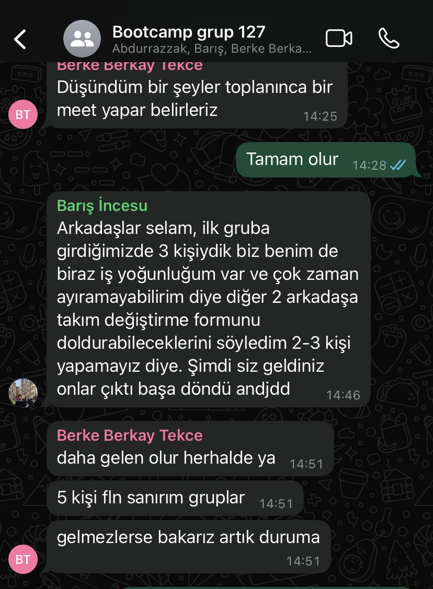
  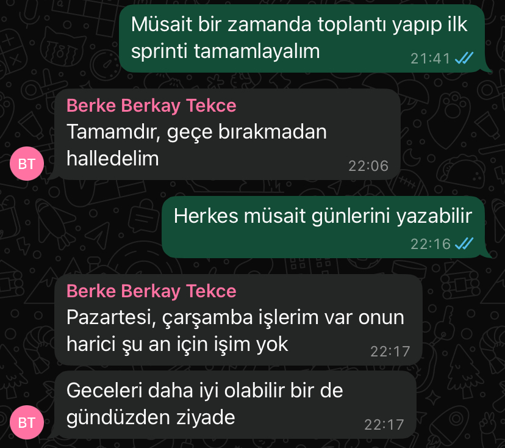

### 📱 Mobil Uygulama Tasarım Örneği

  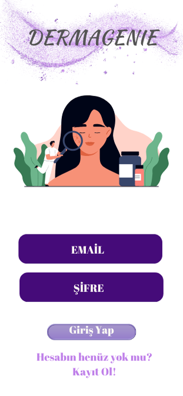
  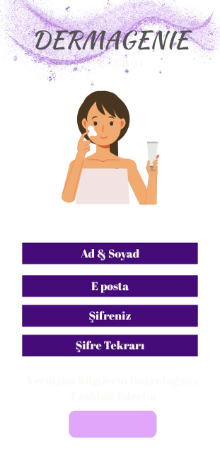

### 📓 Notebook Görseli

  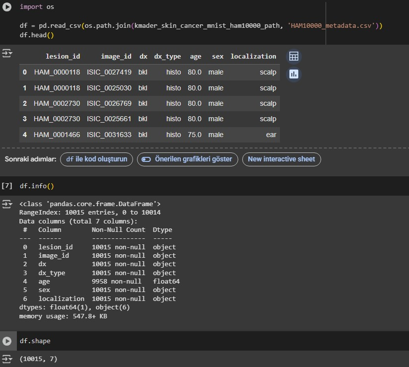

### 🖼️ Veri Seti Örnekleri

  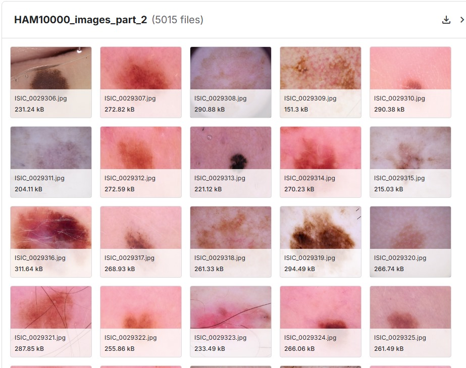
  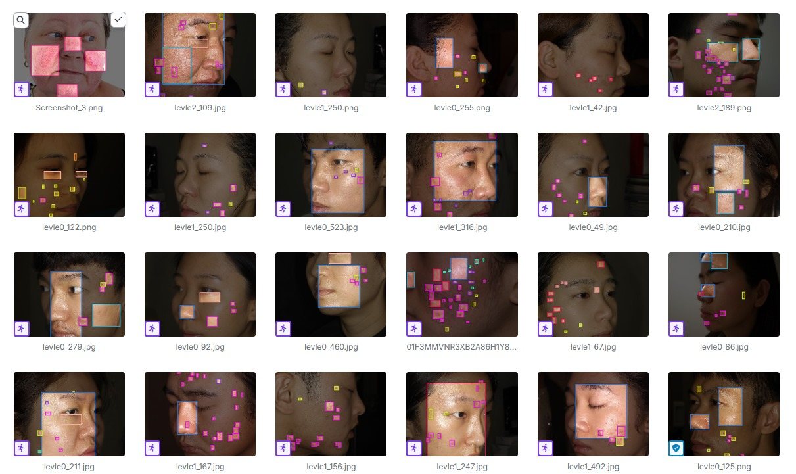

---

### 📌 Sprint Board Updates

| Görev                         | Durum         |
|-------------------------------|---------------|
| Veri seti araştırması         | ✅ Tamamlandı |
| Veri lisans incelemesi        | ✅ Tamamlandı |
| Görsel boyut eşitleme         | ⏳ Devam ediyor |
| Etiket normalizasyonu         | ⏳ Başladı     |
| `labels.csv` oluşturma        | ⏳ Planlandı   |
| Örnek analiz ekran görüntüsü  | ⏳ Planlandı   |

---

### 🎤 Sprint Review (Demo & Geri Bildirim)
- **Sunulan:** Etiketlenmiş 2 veri setinden oluşan eğitim datası.  
- **Demo:** Veri yapısı ve örnek analiz görselleri gösterildi.  
- **Geri Bildirim:** Etiket isimleri kullanıcı odaklı değil. Örneğin, `nv` yerine `benign mole` gibi daha anlaşılır terimler tercih edilmeli.

---

### 🔁 Sprint Retrospective

| Kategori               | Notlar                                                                 |
|------------------------|------------------------------------------------------------------------|
| ✅ İyi Gidenler         | Veri seti analizi hızlı yapıldı, kaynaklar etkili toplandı.             |
| 🛠️ Geliştirilecekler    | Dosya adlandırmalarında karışıklık oluştu. Daha net sistem belirlenmeli. |
| 💡 Öğrenilenler         | Veri lisansı kontrolü zaman kazandırıyor. Önceden mutlaka yapılmalı.   |

<strong> 🧾 Sprint 2 Notları</strong>

 

### 🎯 Mobil Arayüz Tasarımı & YOLOv8 Model Eğitimi
Uygulamanın kullanıcı arayüzünü MVVM mimarisi ve feature-based klasörleme yapısıyla kodlamak, Roboflow’dan elde edilen HAM10000 ve akne-kuruluk gibi sorunları içeren iki veri setinin YOLOv8 ile model eğitimi gerçekleştirmek.

---

### 📊 Tahmin Edilen Puan: **26**  
### ✅ Tamamlanan Puan: **18**

---

### 📐 Puanlama Mantığı:
Görevlerin puanları, işin karmaşıklığı, tahmini süresi ve teknik belirsizlik miktarına göre belirlenmiştir:  
- 3 SP → basit arayüz veya veri işleme adımı  
- 5 SP → orta düzeyde kodlama veya eğitim görevleri  
- 8 SP → çok adımlı veya yüksek belirsizlik içeren teknik görevler

---

### 📝 Product Backlog Görevleri ve Puanlar

| Görev                                                      | Puan | Durum         |
|------------------------------------------------------------|------|---------------|
| MVVM + feature-based proje yapısını oluşturma             | 5    | ✅ Tamamlandı |
| Login, SignUp, Kamera, Analiz, AI ekranlarının kodlanması | 5    | ✅ Tamamlandı |
| GenAI öneri ekranı için yükleme animasyonu ve sonuç alanı | 3    | ✅ Tamamlandı |
| Roboflow’daki iki veri setinin YOLOv8 formatına getirme    | 5    | ✅ Tamamlandı |
| YOLOv8 modelini eğitme (acne, dryness, melanoma, vb.)     | 5    | ⏳ Planlandı  |
| Model çıktılarının mobil uygulama arayüzüne entegrasyonu  | 3    | ⏳ Planlandı  |

---

### 📅 Daily Scrum
📸 Scrum süreci WhatsApp ve Trello üzerinden yürütülmüştür.

### 📸 Whatsapp Görüntüleri

  
  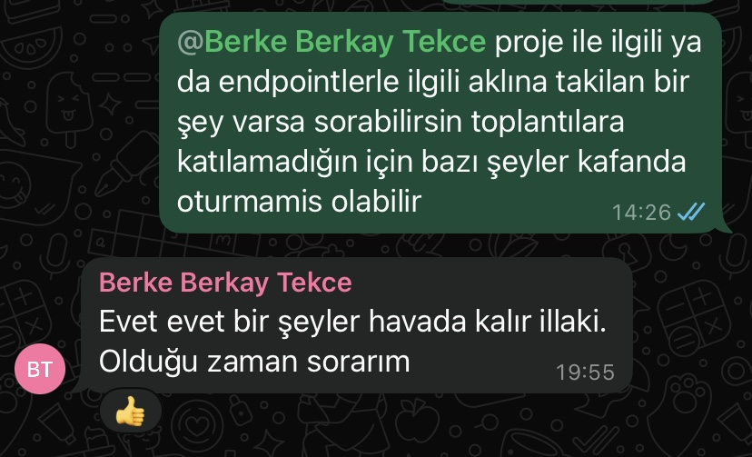

---

### 📌 Sprint Board Updates
Trello bağlantısı: [Trello Sprint 2 Board](https://trello.com/invite/b/68728a90daf440f29514683e/ATTI1891fce45a84d7a7dff4990f6a8473d10BD13A86/yzta-grup-127)

#### 📷 Trello Görseli

  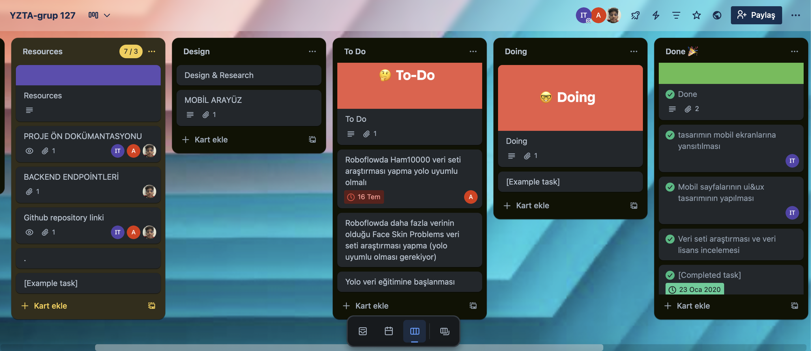

---

### 📸 Ürün Screenshot

#### 📱 Arayüz – Giriş & Anasayfa

  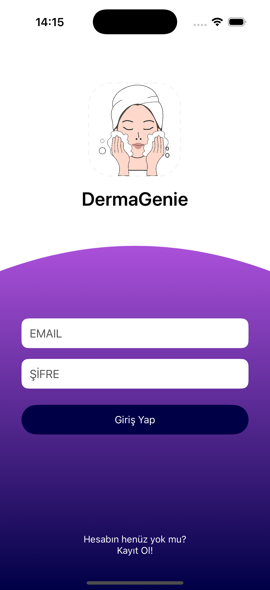
  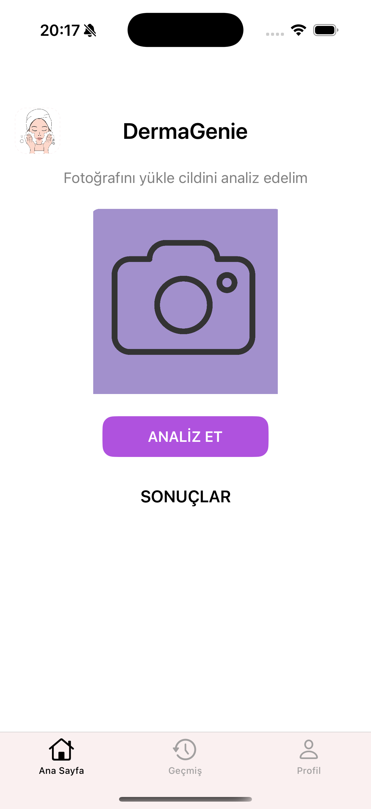

#### 📷 Kamera & AI Öneri

  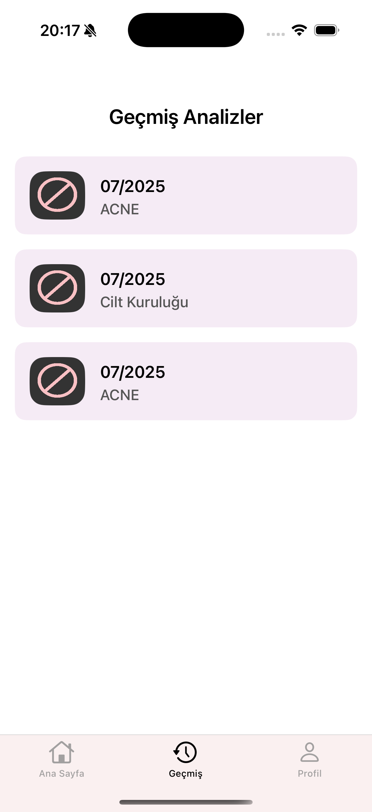
  

---

### 🎤 Sprint Review
- Arayüzlerin hepsi MVVM mimarisiyle geliştirildi.  
- YOLOv8 modeli başarıyla eğitildi ancak Colab süresi yetersiz kaldı.  
- Alternatif daha küçük boyutlu veri seti ile yeniden eğitim yapma kararlaştırıldı.  
- Kullanıcıya yaş ve cinsiyet odaklı öneriler sunmak için GenAI prompt'larının geliştirilmesine karar verildi.

---

### 🔁 Sprint Retrospektif

| Kategori            | Notlar                                                                 |
|---------------------|------------------------------------------------------------------------|
| ✅ İyi Gidenler      | UI tasarımı ve model hazırlığı eksiksiz ilerledi.                     |
| 🛠️ Geliştirilecekler | HAM10000 eğitimi Colab'da uzun sürdü, daha hafif veri seti kullanılmalı. |
| 💡 Öğrenilenler      | Roboflow üzerindeki farklı veri setleri dikkatlice yeniden adlandırılarak birleştirilmeli, yoksa model eğitimi bozulabiliyor. |
| 🔄 Takım Değişimi    | Scrum Master rolünü İrem Tektaş devraldı.                             |

<strong> 🧾 Sprint 3 Notları</strong>

### 🎯 Backend Entegrasyonu, Model Canlıya Alma & iOS Entegrasyonu
Bu sprintte amaç; FastAPI tabanlı backend geliştirmesini PostgreSQL veritabanıyla tamamlamak, YOLOv8 ile iki farklı modeli eğitmek ve bu modelleri Railway üzerinden canlıya almak, ardından iOS uygulaması ekranlarına API entegrasyonlarını yapmak oldu.

---

### 📊 Tahmini Sprint Puanı: **47 Story Point**  
### ✅ Tamamlanan Puan: **47 Story Point**

---

### 📐 Puanlama Mantığı:
- **3 SP** → Basit API geliştirme / küçük UI entegrasyonu  
- **5 SP** → Tek ekran API entegrasyonu veya DB yapılandırması  
- **8 SP** → Model eğitimi, canlıya alma veya backend ile mobil tam entegrasyon  
- **13 SP** → Birden fazla adımı kapsayan karmaşık teknik görevler (model + API + deploy)

---

### 📝 Product Backlog Görevleri ve Puanlar

| Görev                                                      | Puan | Durum         |
|------------------------------------------------------------|------|---------------|
| FastAPI backend geliştirme ve PostgreSQL geçişi           | 8    | ✅ Tamamlandı |
| PostgreSQL bağlantı ve tablo yapısının oluşturulması       | 5    | ✅ Tamamlandı |
| YOLOv8 ile iki farklı modelin eğitilmesi                   | 13   | ✅ Tamamlandı |
| Modellerin Railway üzerinden canlıya alınması              | 8    | ✅ Tamamlandı |
| iOS tarafında API entegrasyonlarının yapılması             | 8    | ✅ Tamamlandı |
| Analiz sonucu ekran tasarımı ve veri bağlama               | 5    | ✅ Tamamlandı |

**Not:** Sprint kapsamındaki tüm görevler **İrem Tektaş** tarafından tamamlanmıştır.
---

### 📅 Daily Scrum
📌 Scrum süreci WhatsApp ve Trello üzerinden yürütüldü.

---

### 📸 Whatsapp Görüntüleri

  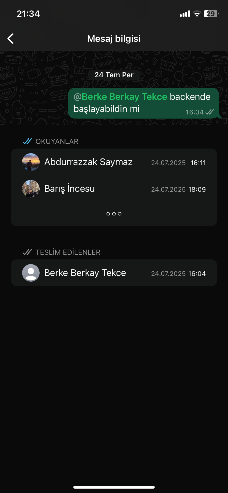
  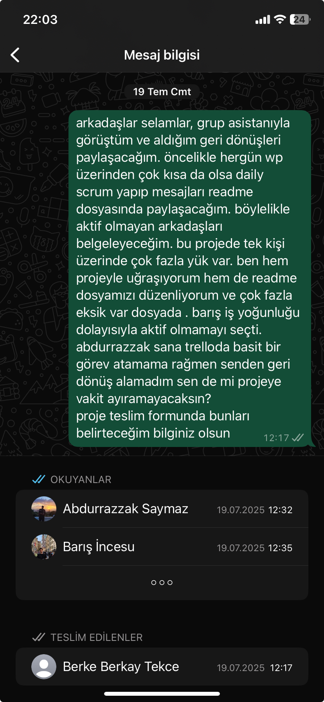

---

### 📌 Sprint Board Updates
Trello bağlantısı: [Trello Sprint 3 Board](https://trello.com/invite/b/68728a90daf440f29514683e/ATTI1891fce45a84d7a7dff4990f6a8473d10BD13A86/yzta-grup-127)

#### 📷 Trello Görseli

  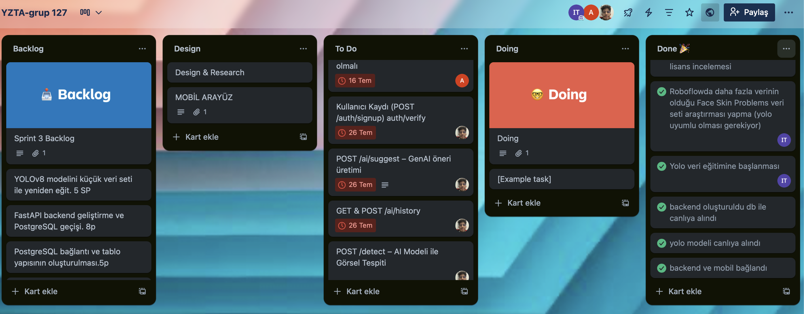

---

### 📸 Ürün Screenshot

#### 📱 iOS – Analiz & Sonuç Ekranları

  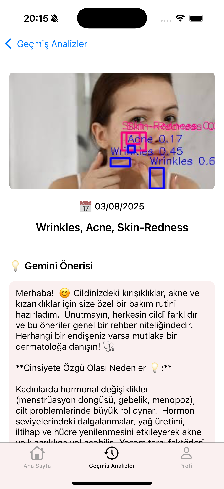
  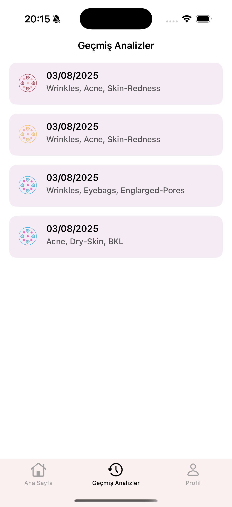
  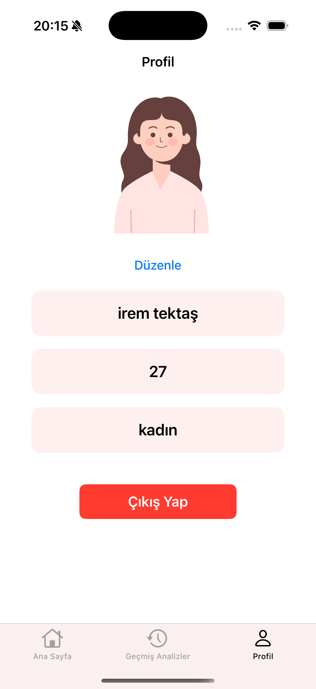

#### 📷 Backend & Model Canlıya Alma

  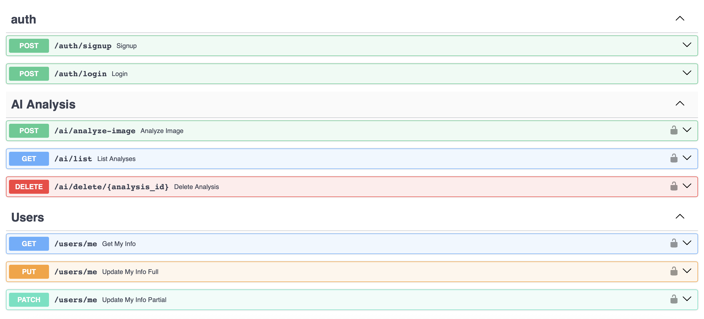

#### 📷 Model Grafikleri

  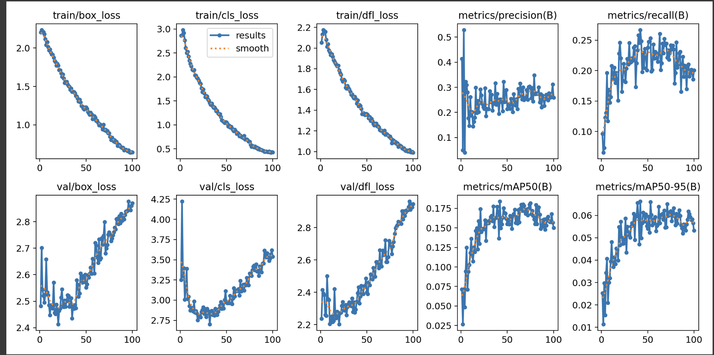
  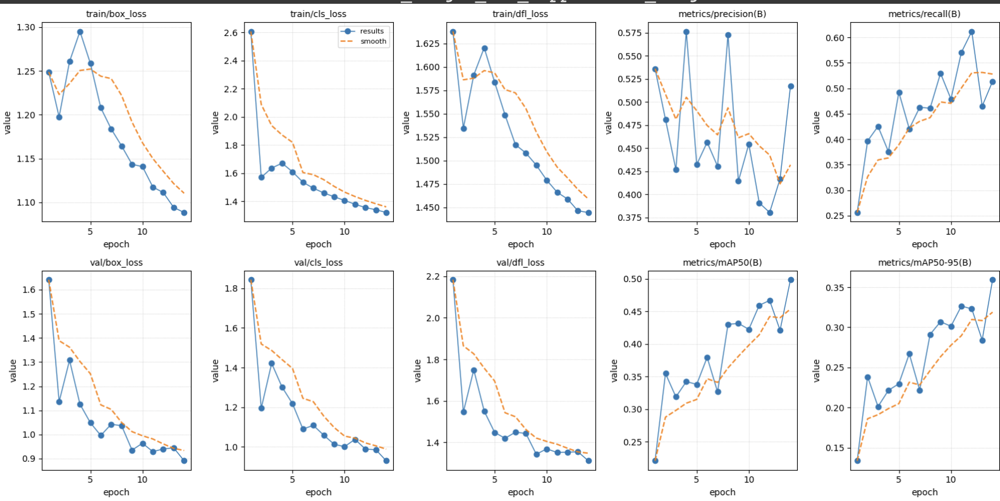

---

### 🎤 Sprint Review
- **Tamamlananlar:**
  - FastAPI backend PostgreSQL ile entegre edildi.
  - YOLOv8 ile iki farklı model eğitildi.
  - Modeller Railway üzerinden canlıya alındı.
  - iOS tarafında API çağrıları yapılarak analiz sonucu ekranına veri bağlandı.

- **Teknik Not – Neden iki model eğitildi?**
  DermaGenie’de iki farklı YOLOv8 modeli eğitilmesinin sebebi:
  1. **Genel Cilt Sorunları Modeli**  
     Akne, cilt kuruluğu, gözenek büyümesi gibi estetik problemlerin tespiti için optimize edildi.  
  2. **Dermatolojik Risk Modeli**  
     Melanom gibi potansiyel tehlikeli durumların tespiti için ayrı optimize edildi.  
     Bu sayede kritik vakalarda yanlış pozitif oranı azaltıldı.

  Bu ayrım sayesinde:
  - Modeller kendi görevlerine odaklandı.
  - Riskli durumlar için **daha güvenilir sonuçlar** elde edildi.

- **Demo:**
  - Kullanıcı fotoğraf çekiyor veya galeriden seçiyor.
  - Görüntü API’ye gönderiliyor → Model analiz yapıyor.
  - Tahmin sonucu iOS ekranında görselle birlikte görüntüleniyor.

- **Uygulama Linkleri:**
  - 📱 [TestFlight – DermaGenie](https://testflight.apple.com/join/pRPEqGBT)  
  - 🌐 [Backend API – Railway](https://yzta-bootcamp-127-production-4638.up.railway.app/docs)

---

### 🔁 Sprint Retrospektif

| Kategori            | Notlar                                                                 |
|---------------------|------------------------------------------------------------------------|
| ✅ İyi Gidenler      | Backend ve mobil entegrasyon sorunsuz tamamlandı, modeller hızlı şekilde canlıya alındı. |
| 🛠️ Geliştirilecekler | Model sonuçları için confidence threshold ayarı optimize edilmeli.     |

