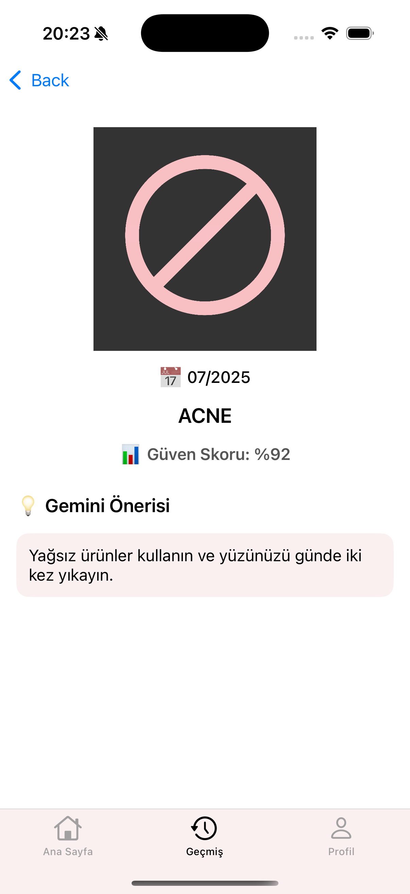

# 🧴 DermaGenie

🌐 Available in: [English](./README.md) | [Türkçe](./README-tr.md)
📺 [Watch the Demo Video](https://www.youtube.com/watch?v=wmuw327AaXU)

---

## 🎯 Product Description
**DermaGenie** is a mobile health application designed for anyone who wants to raise awareness of dermatological conditions.  
The app analyzes facial images captured through a mobile device’s camera and uses a YOLOv8-based AI model to detect conditions such as acne, skin dryness, or melanoma risk.

**After detection:**
- For aesthetic issues (e.g., acne, dryness), users receive GenAI-powered personalized skincare recommendations.  
- For serious dermatological findings (e.g., melanoma suspicion), the app directs the user to a specialist.  

DermaGenie positions AI not only as an analysis tool but also as a **trusted digital skin advisor** that guides and supports the user.

---

## 📱 Key Features
- **Real-time skin analysis**: Captures images with the camera and processes them through an AI model.  
- **Acne Detection**: Provides skincare recommendations and product suggestions when mild or severe acne is detected.  
- **Melanoma Detection**: Flags suspicious spots and guides the user to dermatologists.  
- **GenAI Assistant**: Offers tailored recommendations based on skin type and conditions (cleansers, moisturizers, dermatologist scheduling, etc.).

---

## 🎯 Target Audience
1. **Young Individuals**  
   - Why? Acne, pimples, and oily skin are common issues in this age group.  
   - Expectation: A fast and accessible digital dermatological assessment tool.  

2. **Busy Professionals**  
   - Why? They may not have time to visit a dermatologist but still care about skin health.  
   - Expectation: Quick analysis, medical advice, potential risk alerts.  

3. **Individuals with Limited Access to Healthcare**  
   - Why? Access to dermatologists may be restricted in certain regions.  
   - Expectation: Use as a preliminary AI-powered assessment tool.  

4. **Individuals with Chronic Skin Conditions**  
   - Why? Those suffering from eczema, psoriasis, or dryness may want ongoing monitoring.  
   - Expectation: Tracking through history and recommendations system.  

5. **Beauty & Aesthetics Enthusiasts**  
   - Why? They aim to maintain skin health and optimize beauty routines.  
   - Expectation: Skincare tips, early warnings, aesthetic alignment.  

6. **Health-Conscious Individuals**  
   - Why? They want to detect early signs of potential skin cancer.  
   - Expectation: Reliability, transparent diagnoses, referral to medical professionals.  

### Persona: [📄 Personas](./personalar/persona-eng.pdf)

---

## 🧰 Technologies

### 📷 Image Analysis
- YOLOv8

### ⚙️ Backend
- FastAPI (image processing, recommendation service)  
- Railway (deployment environment)  
- Gemini API (recommendation generation)

### 📱 iOS App
- Swift + UIKit  
- API communication via URLSession  
- Camera usage and image upload  
- User interface: acne detection screen, GenAI recommendation screen  

---

## 🧾 Sprint 1 Notes

### 🎯 Data Exploration & Preparation
Research suitable datasets for conditions like acne, dryness, redness, and melanoma, and complete preprocessing.  

**Estimated Story Points: 21**

| Task                                                | Points |
|-----------------------------------------------------|--------|
| Research and download open datasets                 | 5      |
| Review dataset licenses and ethical use             | 3      |
| Create class mapping and label normalization schema | 3      |
| Standardize image size and color format             | 5      |
| Merge labels with a single `labels.csv` file        | 5      |

---

### 📓 Notebook Preview

  

### 🖼️ Dataset Samples

  
  

---

### 📌 Sprint Board Updates
| Task                        | Status         |
|-----------------------------|----------------|
| Dataset research            | ✅ Completed   |
| License review              | ✅ Completed   |
| Image size normalization    | ⏳ In Progress |
| Label normalization         | ⏳ Started     |
| `labels.csv` creation       | ⏳ Planned     |
| Sample analysis screenshots | ⏳ Planned     |

---

### 🎤 Sprint Review
- **Delivered:** Training data from 2 labeled datasets.  
- **Demo:** Data structure and sample analysis visuals.  

---

### 🔁 Sprint Retrospective
| Category        | Notes                                                     |
|-----------------|-----------------------------------------------------------|
| ✅ What went well | Dataset analysis was quick, and resources were collected effectively. |

---

## 🧾 Sprint 2 Notes

### 🎯 Mobile UI Design & YOLOv8 Model Training
Implement the user interface using MVVM architecture and feature-based foldering. Train YOLOv8 models on two datasets obtained from Roboflow (HAM10000 + acne/dryness).  

**Estimated Points: 26**  
**Completed Points: 18**

---

### 📐 Story Point Logic
- **3 SP** → Simple UI or preprocessing  
- **5 SP** → Medium coding or training tasks  
- **8 SP** → Multi-step or highly uncertain tasks  

---

### 📝 Product Backlog

| Task                                                    | Points | Status       |
|---------------------------------------------------------|--------|--------------|
| Create MVVM + feature-based project structure           | 5      | ✅ Completed |
| Implement Login, SignUp, Camera, Analysis, AI screens   | 5      | ✅ Completed |
| Loading animation & results for GenAI screen            | 3      | ✅ Completed |
| Convert Roboflow datasets into YOLOv8 format            | 5      | ✅ Completed |
| Train YOLOv8 model (acne, dryness, melanoma, etc.)      | 5      | ⏳ Planned   |
| Integrate model outputs into iOS UI                     | 3      | ⏳ Planned   |

---

### 📅 Daily Scrum
Conducted via WhatsApp & Trello.  

---

### 📌 Sprint Board Updates
Trello: [Sprint 2 Board](https://trello.com/invite/b/68728a90daf440f29514683e/ATTI1891fce45a84d7a7dff4990f6a8473d10BD13A86/yzta-grup-127)

  

---

### 📸 Screenshots
**UI – Login & Home**  

  
  

**Camera & AI Suggestions**  

  
  

---

### 🎤 Sprint Review
- All screens developed with MVVM architecture.  
- YOLOv8 successfully trained, though Colab runtime was insufficient.  
- Decided to re-train with a smaller dataset.  
- GenAI prompts to be refined for personalized age/gender recommendations.  

---

### 🔁 Sprint Retrospective
| Category          | Notes                                                              |
|-------------------|--------------------------------------------------------------------|
| ✅ What went well | UI design and dataset preparation were executed successfully.      |
| 🛠️ To improve    | HAM10000 training was slow on Colab, need lighter datasets.        |
| 🔄 Team Changes  | Scrum Master role transitioned to İrem Tektaş.                      |

---

## 🧾 Sprint 3 Notes

### 🎯 Backend Integration, Model Deployment & iOS Integration
This sprint focused on completing the FastAPI backend with PostgreSQL, training two YOLOv8 models, deploying them via Railway, and integrating the APIs into iOS screens.  

**Estimated Points: 47**  
**Completed Points: 47**

---

### 📝 Product Backlog

| Task                                           | Points | Status       |
|------------------------------------------------|--------|--------------|
| Develop FastAPI backend and PostgreSQL migration | 8      | ✅ Completed |
| Configure PostgreSQL connection and tables       | 5      | ✅ Completed |
| Train two YOLOv8 models                         | 13     | ✅ Completed |
| Deploy models via Railway                       | 8      | ✅ Completed |
| Implement API integrations on iOS               | 8      | ✅ Completed |
| UI design and binding for analysis results      | 5      | ✅ Completed |

---

### 📌 Sprint Board Updates
Trello: [Sprint 3 Board](https://trello.com/invite/b/68728a90daf440f29514683e/ATTI1891fce45a84d7a7dff4990f6a8473d10BD13A86/yzta-grup-127)

  

---

### 📸 Screenshots

**iOS – Analysis & Results**  

  
  
  

**Backend & Deployment**  

  

**Model Training Results**  

  
  

---

### 🎤 Sprint Review
- **Completed:**  
  - Backend with PostgreSQL integration.  
  - Two YOLOv8 models trained and deployed.  
  - API integrations added to iOS app.  

- **Why two models?**  
  1. **General Skin Issues Model** – optimized for acne, dryness, enlarged pores.  
  2. **Dermatological Risk Model** – optimized for melanoma detection, reducing false positives.  

This separation ensures **more reliable results** for critical cases.  

**Demo:** User takes/selects a photo → image sent to API → AI returns predictions → results displayed in iOS app.  

---

### 🔁 Sprint Retrospective
| Category          | Notes                                                                  |
|-------------------|------------------------------------------------------------------------|
| ✅ What went well | Backend and mobile integration were smooth, models deployed successfully. |

---
